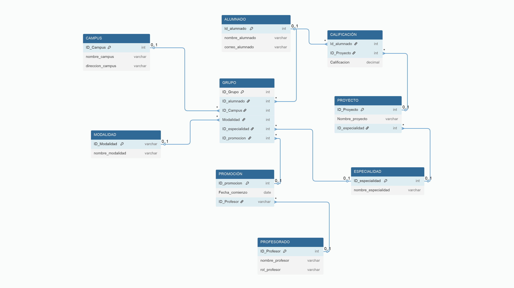

# proyecto_bbdd
Este proyecto consiste en la creación y gestión de una base de datos SQL, donde se recojan los datos de los Campus de TheBridge, con sus verticales, profesores, alumnados, proyectos, etc.
Los objetivos principales son la realización de un esquema ER, un modelo lógico de base de datos, introducir las queries de creación de tablas e inserción de datos y queries de consulta. 

## Tecnologías usadas
- SQL (PostgreSQL)
- Render
- Drawio
- pgAdmin 4

## 🎯 Objetivo del proyecto
- Creación de un esquema ER
- Crear un modelo lógico de bases de datos
- Normalización de los datos
- Creación de una base de datos SQL en render

## 📸 Capturas de pantalla

## 🚀 Cómo ejecutar el proyecto

1. Clonar repositorio de GitHub

git clone [https://github.com/NazaretMelquiades/proyecto_bbdd.git]

### 🌐 Proyecto desplegado
Puedes ver el proyecto online en:

[https://dashboard.render.com/d/dpg-d1mhod15pdvs73d2id40-a/info]

## 📚 Lecciones aprendidas
- Planificar de forma eficiente las tareas
- Creación de diagrama entidad-relacion
- Creación de modelo lógico de base de datos 
- Gestión de errores
- Creación de queries
- Creación base de datos SQL

## 🔧 Funcionalidades futuras
- 
## 📂 Estructura del proyecto
README.md - documentación
assets/diagrama ER, modelo lógico

## 🧑‍💻 Autores
- Nombres: Yan Jun Chen, Isabel Bravo Quiñones, Pierre Michel Jossaint, Karla Serrano, María de Nazaret Melquiades